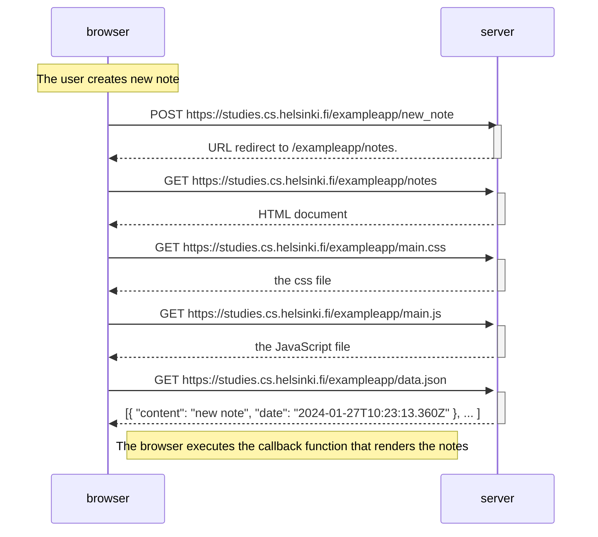

```mermaid
sequenceDiagram
    participant browser
    participant server

    Note over browser: The user creates new note

    browser->>server: POST https://studies.cs.helsinki.fi/exampleapp/new_note

    activate server

    server-->>browser: URL redirect to /exampleapp/notes.

    deactivate server

    activate server

    browser->>server: GET https://studies.cs.helsinki.fi/exampleapp/notes

    activate server

    server-->>browser: HTML document

    deactivate server

    browser->>server: GET https://studies.cs.helsinki.fi/exampleapp/main.css

    activate server

    server-->>browser: the css file

    deactivate server

    browser->>server: GET https://studies.cs.helsinki.fi/exampleapp/main.js

    activate server

    server-->>browser: the JavaScript file

    deactivate server

    browser->>server: GET https://studies.cs.helsinki.fi/exampleapp/data.json
    activate server
    server-->>browser: [{ "content": "new note", "date": "2024-01-27T10:23:13.360Z" }, ... ]
    deactivate server

    Note right of browser: The browser executes the callback function that renders the notes


    
    


```
