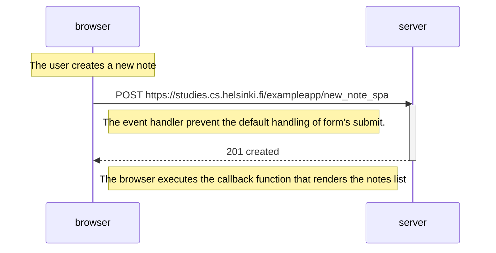

```mermaid
sequenceDiagram
    participant browser
    participant server

    Note over browser: The user creates a new note


    browser->>server: POST https://studies.cs.helsinki.fi/exampleapp/new_note_spa

    activate server

    Note right of browser: The event handler prevent the default handling of form's submit.

   

    server-->>browser: 201 created

    deactivate server

    

    Note right of browser: The browser executes the callback function that renders the notes list

    
    


```

